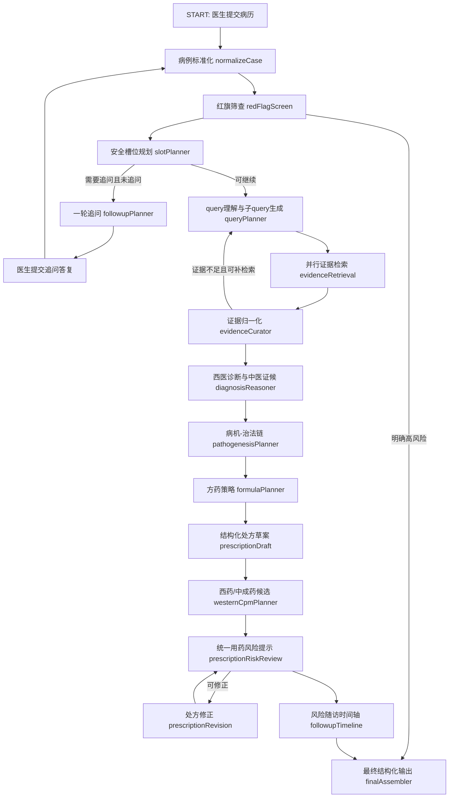

# 中医 CDSS ReAct 智能体开发架构文档

## 1. 建设目标

中医 CDSS 建设目标是形成面向门诊医生的中医辅助诊疗 Copilot。系统基于医生录入的一诉五史、生命体征、四诊信息、必要检验检查和既往用药信息，完成红旗风险识别、信息缺口判断、循证检索、西医诊断、中医证候辨识、病机拆解、治法推导、中药饮片候选处方、西药或中成药联合/替代方案、用药风险提示和随访计划输出。

系统定位为临床辅助决策，不替代医生诊断和处方权。所有诊断、证候、处方和风险建议均必须可追溯到患者事实、规则命中、知识库条目、指南/说明书/药典/文献证据或明确标注“证据不足/待检索”。

## 2. 当前问题定位

现有实现以 M01-M05 线性阶段为主，前端承担较多流程编排，后端按 `collect / question / diagnose / prescribe / assess` 分阶段工作。M01/M02 当前为流式 Markdown 加 sentinel JSON，前端再抽取结构化字段；M03/M04/M05 主要以 Markdown NDJSON 展示结果。该方式存在以下结构性问题：

1. LLM 当前在 M01、M02、M03、M04 均存在调用路径；M02 同时存在前端本地确定性追问路径；M05 当前主要为本地规则输出。整体尚未形成“理解问题-调用工具-观察证据-修正推理”的 ReAct 闭环。
2. 证据检索当前主要由 M03/M04 调用 `buildCdssEvidenceContext`，内容包括官方基础依据、本地中医知识库和 EviMed 指南接口结果；M05 不走统一证据层。当前仍缺少 query 理解、子 query 拆分、证据类型规划、证据归一化和证据冲突处理。
3. 中药饮片候选处方以 Markdown 形式生成，后置审方再从 Markdown 反解析药味和剂量，风险较高，且难以稳定渲染到 HIS。
4. 追问、`withSafetyGate`、M03 完整度判断和 M04 处方前正则门控割裂，容易出现追问完成后仍被后置门控拒方，或处方阶段才显示无法生成候选方药的断裂体验。
5. 红旗风险、信息充分度、处方风险等状态应由结构化状态机输出，而不应依赖模型散文或前端正则解析。
6. EviMed、合理用药项目数据、本地中医知识库、官方资料和联网兜底尚未形成统一证据层，模型可能在证据不足时产出看似真实但不可核验的引用。

本次重构应从线性 prompt 链升级为 LangGraph/ReAct 智能体编排：每一步均有结构化输入输出、证据约束、错误降级和可审计 trace。

## 3. 总体技术路线

后端采用 LangGraph `StateGraph` 构建 CDSS 工作流。每个节点只负责一个明确任务，读取共享状态并返回状态增量。节点之间通过条件边控制是否追问、是否进入处方、是否仅输出安全建议、是否触发证据补检索和处方修正。

前端仍采用 Next.js/React，但前端不再承担临床推理编排。前端只负责病历录入、舌象上传、四诊点选、追问答复、结构化结果渲染和报告下载。

核心原则：

1. 病历输入和 AI 输出分离：医生未点击 AI 辅助推理前，不显示红旗风险、信息充分度和处方风险结论。
2. 缺项判断由智能体统一完成：只追问真正影响本次辨证、红旗排查或候选处方安全的槽位。
3. 证据先行：诊断、证候、治法、方药、剂量、说明书和风险提示均需绑定证据 ID。
4. 处方先结构化后渲染：候选处方以 JSON 为准，Markdown 仅作为报告导出格式。
5. 审方不替医生作最终处方裁决：系统不输出“系统通过/系统驳回”。PASS、提醒、人工复核、BLOCK、未知结果和服务不可用均只生成分级风险提示与医生/药师复核点，不改变诊疗阶段、不锁定候选方案；急危重红旗、关键资料缺失、输出截断和处方对象不一致等独立确定性安全门仍可阻断。
6. 安全门控用于流程边界和输出层级：急危重红旗或关键资料不足时不生成剂量级候选处方；已完成最低安全复核后的风险结果以醒目提示、修正建议和医生复核点呈现。

## 4. LangGraph 状态模型

建议新增服务端目录：

```txt
src/server/tcm-cdss/
  graph.ts
  state.ts
  schemas.ts
  nodes/
    normalize-case.ts
    red-flag-screen.ts
    slot-planner.ts
    followup-planner.ts
    query-planner.ts
    evidence-retrieval.ts
    evidence-curator.ts
    diagnosis-reasoner.ts
    pathogenesis-planner.ts
    formula-planner.ts
    prescription-draft.ts
    prescription-risk-review.ts
    prescription-revision.ts
    western-cpm-planner.ts
    followup-timeline.ts
    final-assembler.ts
  tools/
    evimed-guide.ts
    evimed-evidence.ts
    evimed-instruction.ts
    local-tcm-kb.ts
    rx-audit-kb.ts
    official-web-search.ts
  repositories/
    run-store.ts
    evidence-store.ts
    knowledge-version.ts
```

共享状态建议如下：

```ts
export type TcmCdssState = {
  requestId: string;
  runId: string;
  threadId: string;
  checkpointId?: string;
  caseVersion: number;
  followupRound: number;
  evidenceRetryCount: number;
  prescriptionRevisionCount: number;
  model: {
    provider: "deepseek" | "openai-compatible" | "bailian" | "mock";
    name: string;
    reasoningEffort: "low" | "medium" | "high";
    nodeReasoningEffort?: Record<string, "low" | "medium" | "high">;
  };
  rawCase: TcmCdssCaseInput;
  normalizedCase?: NormalizedTcmCase;
  redFlagAssessment?: RedFlagAssessment;
  slotAssessment?: SlotAssessment;
  followup?: FollowupRound;
  queryPlan?: EvidenceQueryPlan;
  evidenceRaw: EvidenceHit[];
  evidenceBundle?: CuratedEvidenceBundle;
  westernDiagnosis?: WesternDiagnosisResult;
  tcmSyndrome?: TcmSyndromeResult;
  pathogenesis?: PathogenesisGraph;
  formulaPlan?: FormulaPlan;
  herbalPrescription?: HerbalPrescriptionSet;
  westernCpmPlan?: WesternCpmPlan;
  prescriptionRiskReview?: PrescriptionRiskReview;
  followupTimeline?: FollowupTimeline;
  finalPayload?: TcmCdssAiSupportPayload;
  trace: NodeTrace[];
  errors: NodeError[];
};
```

状态中只保存可审计推理摘要、工具调用、证据引用和节点输出，不保存或外显模型隐藏思维链。

`reasoningEffort` 为默认值，不得强制所有节点使用 high。`normalizeCase`、`slotPlanner`、`queryPlanner`、确定性安全规则等节点默认 low/medium；需要多证据综合的 `diagnosisPlanner`、`formulaPlanner`、`riskSynthesizer` 可显式提升到 high，并记录在 `nodeReasoningEffort`。

基础字段必须采用统一事实状态表达，避免把未询问、未知、否认、历史阳性、疑似阳性和当前阳性混为一类：

```ts
export type ClinicalFactStatus =
  | "positive"
  | "possible"
  | "negative"
  | "historical"
  | "unknown"
  | "not_asked"
  | "not_applicable";

export type ClinicalFact<T = string> = {
  status: ClinicalFactStatus;
  value?: T;
  source: "doctor_input" | "patient_report" | "device" | "image_ai" | "llm_extracted" | "rule_inferred";
  evidenceText?: string;
  confidence: "high" | "medium" | "low";
};

export type NodeTrace = {
  node: string;
  startedAt: string;
  finishedAt?: string;
  status: "started" | "completed" | "failed" | "skipped" | "degraded";
  inputHash?: string;
  outputHash?: string;
  schemaValid?: boolean;
  toolCalls?: Array<{ tool: string; query?: string; status: string; evidenceIds?: string[] }>;
  routeDecision?: string;
  retryCount?: number;
  degradedReason?: string;
};
```

## 5. ReAct 节点流程



关键条件边：

1. `redFlagScreen` 命中明确急危重风险时，进入 `finalAssembler` 输出急诊/转诊建议，不生成剂量级中药饮片处方。
2. `slotPlanner` 判断缺少本次处方级推理必需信息时，进入 `followupPlanner`，最多追问一轮。
3. 追问后仍不能支撑剂量级处方时，允许输出诊断倾向、证候可能性、风险提示和需补充信息，不生成具体剂量处方。
4. 证据检索不足时，允许触发一次 query 修正和补检索；仍不足时相应字段标注“证据不足/待检索”。
5. 中药饮片、西药和中成药候选方案必须先全部形成结构化草案，再进入统一风险复核，避免任何候选用药绕过审查。
6. `prescriptionRiskReview` 不替医生作最终处方裁决，但会输出 `reviewDisposition`，决定前端展示为“可展示候选处方”“需修正后展示”“不生成剂量级处方”或“需药师复核”。

条件边必须使用明确枚举：

```ts
export type CdssRoute =
  | "proceed"
  | "ask_followup"
  | "red_flag_referral"
  | "insufficient_information"
  | "retry_retrieval"
  | "revise_prescription"
  | "finalize";

export type RouteDecision = {
  route: CdssRoute;
  reason: string;
  maxLoopReached?: boolean;
  requiredStatePatch?: Partial<TcmCdssState>;
};
```

循环上限：追问最多 1 轮；证据补检索最多 1 次；处方修正最多 1 次。达到上限后必须进入明确终态，不允许无限等待或静默失败。

## 6. 安全槽位策略

系统不把年龄、生命体征和检验检查设为初始一刀切必填，是否追问取决于本次主诉、红旗风险和特殊人群风险。性别/生理状态、过敏史和当前用药在 M03 辨证阶段可为 `not_asked` 或 `unknown`，但处方级输出前必须完成事实状态归一并定向追问；任何未提及状态都不得当作低风险或被“跳过追问”绕过。

### 6.1 启动必需项

1. 主诉：必填。
2. 病程或发作时间：缺失时优先追问；若医生只录入“睡不着觉”等极简主诉，系统应先进入一轮追问，而不是直接失败。
3. 四诊信息：舌象和脉象是中医处方级推理的重要证据。舌象支持图片上传、手动输入、关键词点选；脉象支持手动输入、关键词点选。若缺失，优先追问或提示补采。

### 6.2 条件必需项

| 条件 | 需要补充的信息 | 目的 |
|---|---|---|
| 胸痛、气促、晕厥、意识异常、剧烈头痛、急腹痛、出血、高热寒战等 | 生命体征、持续时间、伴随症状、必要转诊线索 | 急危重红旗判断 |
| 儿童或低体重患者 | 年龄、体重 | 剂量安全和特殊人群用药 |
| 育龄女性且处方候选含妊娠慎禁用药，或主诉涉及妇科/妊娠风险 | 妊娠、备孕、哺乳、末次月经 | 特殊人群风险提示 |
| 已提及过敏但不完整 | 过敏原、反应、严重程度 | 候选药物风险提示 |
| 已提及当前用药但不完整 | 药名、剂量、频次、疗程 | 联用相互作用和重复用药提示 |
| 候选方含毒性饮片、峻烈药、活血破血药、强镇静/降压/降糖相关药物 | 肝肾功能、基础病、当前用药、特殊人群状态 | 高风险药味复核 |
| 西药/中成药候选方案拟输出具体药品 | 适应证、禁忌、说明书关键限制、当前用药 | 说明书和指南一致性 |

剂量级中药饮片候选方展示前，系统至少需要形成以下状态值：性别/生理状态或妊娠可能性、过敏/ADR 状态、当前西药/中成药/中药/保健品状态；儿童还必须有体重。状态值可以是“无”“有清单”“不清楚”“未询问”“不适用”，其中“不清楚/未询问”必须进入定向追问并阻断 M04，不能只列为一般复核项。年龄及生命体征按红旗、儿童、特殊人群和候选方案风险按需追问。

### 6.3 不作为通用必填

面色照片不上传，不影响流程；面色仅使用医生点选或手动输入的特征词。家族史、职业史、情志、饮食偏好、居住环境、检验检查结果在稳定低风险门诊中默认不是硬门槛，但可作为辨证、随访和检查建议依据。

## 7. 证据检索体系

证据层采用“本地知识库优先、EviMed 检索增强、官方联网兜底、证据统一归一化”的架构。

### 7.1 数据源分层

| 层级 | 数据源 | 接入方式 | 用途 |
|---|---|---|---|
| L1 本地中医规则 | `tcm_dose_limits.json`、`tcm_safety_rules.json`、十八反十九畏、煎服法、毒性饮片、别名映射 | 结构化规则库 | 剂量、禁慎用、特殊煎法、处方风险提示 |
| L2 合理用药知识库 | PostgreSQL seed、药品主库、说明书库、相互作用、禁忌适应症、ADR、ICD/ATC/DDD | 复用 ETL 或恢复 seed | 西药/中成药说明书、联用风险、药品归一 |
| L3 EviMed 指南接口 | 当前中医 CDSS 已适配 `POST /review/api/guide`，依据本地 EviMed 文档 | 指南检索 | 指南、共识、临床实践依据 |
| L4 EviMed 说明书/全文证据 | 合理用药项目已有 `/review/api/instruction`、`/drug-api/instructions/text`、`/search/api/evidence` 客户端 | 需在本项目验证授权、响应格式和费用策略后接入 | 说明书、文献、指南、临床试验证据补充 |
| L5 官方联网兜底 | 国家卫健委、国家中医药管理局、国家药监局、国家药典委员会、PubMed/PMC 等白名单 | 检索工具 + 缓存 + 人工可核验链接 | 当本地和 EviMed 证据不足时补充可核验来源 |

展示检索和安全审查的优先级不同：面向医生的资料展示可优先调用 EviMed 和官方联网证据；处方安全审查必须以本地版本化规则和已验证说明书结构化数据为主，外部检索仅作为补充证据，不得替代本地规则执行。

### 7.2 Query 理解和子 query 拆分

`queryPlanner` 由 LLM 生成结构化检索计划，不直接让模型凭空回答。输出示例：

```ts
export type EvidenceSubQuery = {
  id: string;
  purpose:
    | "western_diagnosis"
    | "tcm_syndrome"
    | "treatment_principle"
    | "formula_source"
    | "herb_dose"
    | "herb_safety"
    | "cpm_or_western_label"
    | "interaction"
    | "red_flag"
    | "followup";
  query: string;
  sourceTargets: EvidenceSourceTarget[];
  expectedEvidenceTypes: EvidenceType[];
  mustHave: string[];
  filters?: {
    startYear?: number;
    endYear?: number;
    publishers?: string[];
    language?: "zh" | "en" | "mixed";
  };
  fallbackQueries: string[];
};
```

以“失眠多梦、入睡困难”为例，系统应拆分为：

1. 失眠西医诊断、鉴别诊断和红旗风险。
2. 失眠相关中医证候、病机和治法。
3. 候选方剂出处和适应证。
4. 候选饮片的药典剂量、禁忌、特殊煎法。
5. 候选中成药或西药说明书适应证、禁忌、相互作用和用法用量。
6. 随访指标、无效或加重时的复诊/转诊依据。

### 7.3 证据归一化

所有证据统一归一为 `EvidenceCitation`：

```ts
export type EvidenceCitation = {
  id: string;
  sourceType:
    | "guide"
    | "drug_label"
    | "pharmacopoeia"
    | "local_rule"
    | "formula_reference"
    | "paper"
    | "official_policy"
    | "web_official";
  title: string;
  publisher?: string;
  year?: string;
  url?: string;
  sourceId?: string;
  quote?: string;
  evidenceLevel: "high" | "moderate" | "low" | "insufficient";
  usedFor: string[];
  retrievedAt: string;
};
```

输出端统一使用 `[EVID-xxx]` 引用。没有证据 ID 的结论不得显示为“有依据”，只能标注“证据不足/待检索”。

## 8. 辨证与处方推理架构

中医推理链采用“症状 + 四诊 -> 证候 -> 总体病机 -> 子病机 -> 子治法 -> 药组 -> 候选处方 -> 风险提示”的结构。

### 8.1 证候与病机

`diagnosisReasoner` 输出：

1. 西医诊断：按“考虑/需排除/证据不足”分级，不把 AI 推测写成确诊。
2. 中医诊断：页面以证候为核心展示，例如心脾两虚证、痰热扰心证、肝郁化火证等；结构化数据中保留 `diseaseName` 可选字段用于 HIS/审方对接，证据不足时标记“待医师确认”，不在主界面把病名作为核心结论。
3. 支持证据：症状、舌象、脉象、寒热汗出、饮食二便、睡眠情志、既往史、生命体征等。
4. 反证/冲突点：与证候不一致或缺失的信息。
5. 证据依据：指南、教材、方剂来源、知识库、药典或待检索标识。

`pathogenesisPlanner` 将证候拆为：

```ts
export type PathogenesisGraph = {
  overallPathogenesis: string;
  subMechanisms: Array<{
    id: string;
    name: string;
    weight: "primary" | "secondary" | "minor";
    patientFacts: string[];
    treatmentPrinciple: string;
    evidenceIds: string[];
  }>;
};
```

### 8.2 方药策略

`formulaPlanner` 不是直接开方，而是先规划方药策略：

1. 基础方或经验方候选。
2. 每个子病机对应的治疗方向。
3. 每个治疗方向对应的主要治疗药物、增强配伍、对症药物、调和/引经药物。
4. 加减逻辑：必须写成“因为某症状/四诊/子病机，所以加减某药或调整剂量，依据某证据”。
5. 适用条件和不适用条件。

### 8.3 中药饮片处方

`prescriptionDraft` 输出结构化候选处方：

```ts
export type HerbalPrescriptionLine = {
  lineNo: number;
  herbName: string;
  processedSpec?: string;
  dose: {
    value: number;
    unit: "g";
    range?: string;
  };
  decoctionMethod?: string;
  monarchMinisterAssistantCourier: "君" | "臣" | "佐" | "使";
  role: "主要治疗" | "增强配伍" | "对症处理" | "调和引经";
  targetMechanismIds: string[];
  targetSymptoms: string[];
  rationale: string;
  evidenceIds: string[];
  safetyTags: string[];
};

export type HerbalPrescriptionCandidate = {
  id: string;
  name: string;
  sourceFormula?: string;
  positioning: "首选候选" | "备选候选";
  doseCount: number;
  administration: string;
  course: string;
  applicableConditions: string[];
  inapplicableConditions: string[];
  modificationRationale: Array<{
    trigger: string;
    action: string;
    reason: string;
    evidenceIds: string[];
  }>;
  lines: HerbalPrescriptionLine[];
  reviewDisposition?: "可展示候选处方" | "需修正后展示" | "不生成剂量级处方" | "需药师复核";
  pharmacistReviewRequired?: boolean;
  overrideReasonRequired?: boolean;
};
```

### 8.4 西药/中成药方案

西药/中成药可作为联合治疗、短期对症或替代方案展示。仅当西医诊断、适应证、说明书禁忌和证据足以支持时输出具体药品；证据不足时只输出“需医生按诊断、说明书、指南和院内药事规则另行评估”。

输出字段包括药品类型、药品名、规格、用法用量边界、疗程、联合/替代关系、存在意义、适用条件、证据依据、联用风险和医生复核点。

## 9. 处方风险提示

处方风险提示作为独立节点 `prescriptionRiskReview`，输入为结构化候选处方而非 Markdown 文本。检查范围包括：

1. 十八反、十九畏。
2. 药典剂量上下限。
3. 毒性饮片、特殊煎服法、炮制品要求。
4. 妊娠、哺乳、儿童、老人、肝肾功能异常等特殊人群。
5. 已知过敏和 ADR 史。
6. 当前西药/中成药/中药/保健品联用风险。
7. 重复用药和功效叠加。
8. 西药/中成药说明书禁忌、注意事项和相互作用。
9. 疗程过长、剂量异常、用法不完整。

风险输出分级：

```ts
export type RiskWarning = {
  id: string;
  severity: "强提示" | "一般提示" | "信息不足提示";
  category:
    | "contraindication"
    | "interaction"
    | "dose"
    | "special_population"
    | "decoction"
    | "adr"
    | "duplicate"
    | "missing_context";
  relatedLines: number[];
  riskPoint: string;
  evidenceIds: string[];
  doctorAction: string;
};
```

风险提示有则展示，无则不展示；不得用泛化“未提及过敏史/当前用药”污染输出。只有已提及但不完整，或候选药物明确依赖该信息判断风险时，才提示医生确认。

审方服务失败时的输出规则：始终明确标记“审方不可用，需医生/药师人工复核”，但审方失败本身不阻断候选方案；若本地独立确定性安全门未完成，则由该安全门降级为方药策略、需补充项和人工复核提示。

## 10. API 设计

建议新增统一入口：

```txt
POST /api/tcm-cdss/run
POST /api/tcm-cdss/runs/{runId}/followup
GET  /api/tcm-cdss/runs/{runId}
GET  /api/tcm-cdss/runs/{runId}/events
POST /api/tcm-cdss/evidence/search
POST /api/tcm-cdss/prescription/review
```

`/api/tcm-cdss/run` 负责启动完整 LangGraph 流程。若需要追问，返回 `status: "needs_followup"` 和结构化问题；医生提交追问答复后，通过 `/followup` 自动恢复同一个 `runId`，继续后续推理。

前端可使用 SSE 订阅 `/events`，展示当前节点进度，例如“病例标准化中”“证据检索中”“处方风险复核中”，但不展示模型隐藏思维链。

请求、响应和 SSE 事件必须统一：

```ts
export type CdssSseEvent =
  | { event: "run.started"; id: number; runId: string; caseVersion: number }
  | { event: "node.started"; id: number; runId: string; node: string; label: string }
  | { event: "node.completed"; id: number; runId: string; node: string; progress: number }
  | { event: "needs_followup"; id: number; runId: string; questions: FollowupQuestion[] }
  | { event: "payload.partial"; id: number; runId: string; payload: Partial<TcmCdssAiSupportPayload> }
  | { event: "run.completed"; id: number; runId: string; payload: TcmCdssAiSupportPayload }
  | { event: "run.failed"; id: number; runId: string; code: string; message: string }
  | { event: "heartbeat"; id: number; runId: string; at: string };
```

SSE 支持 `Last-Event-ID` 断线续传；每个事件包含递增序号。新 API 必须同步纳入 `src/proxy.ts` 鉴权 matcher，旧 `/api/diagnosis/*` 在迁移期保留兼容代理或明确废弃，回归脚本同步切换到 `/api/tcm-cdss/run`。

LangGraph 使用 checkpointer 持久化 `thread_id/runId/checkpointId`。追问恢复接口必须校验 `caseVersion`，防止医生修改病历后把旧追问答复合并到新病例。

## 11. 失败降级

1. 模型 JSON 不符合 schema：自动重试一次结构化输出；仍失败则返回模板化缺口报告。
2. EviMed 超时或 401/403/429：记录检索失败状态，改用本地证据和官方联网兜底；输出中标注具体证据源不可用。
3. 联网兜底无结果：禁止模型伪造引用，字段标注“证据不足/待检索”。
4. 证据冲突：展示冲突摘要和来源，不给确定性处方理由。
5. 处方风险复核异常：若本地最低安全规则完成，候选处方可显示为“待药师复核”；若最低安全规则未完成，不展示剂量级处方，降级为方药策略和人工复核提示。
6. 红旗高风险：不生成剂量级中药处方，输出转诊/急诊建议和可携带病历摘要。

## 12. 知识库建设

建议建立独立中医 CDSS 知识库，避免继续从前端或 Markdown 中临时解析。

核心表：

1. `knowledge_versions`：知识库版本、来源、更新时间。
2. `evidence_items`：指南、说明书、药典、规则、方剂、文献、官方网页。
3. `tcm_herb_monographs`：饮片标准名、别名、性味归经、功效、常用量、煎服法、禁忌。
4. `tcm_formula_references`：经方、验方、院内方、方剂组成、适应证和出处。
5. `tcm_dose_limits`：药典剂量规则。
6. `tcm_safety_rules`：特殊人群、毒性、禁慎用、煎服法规则。
7. `tcm_compatibility_rules`：十八反、十九畏和配伍禁忌矩阵。
8. `drug_labels`：西药/中成药说明书结构化字段。
9. `drug_interactions`：药品相互作用和重复用药规则。
10. `case_runs`：每次 CDSS 推理状态、证据、输出和医生确认记录。

`case_runs` / HIS 快照需保留医生选择的 `tcmLineagePreference`（诊疗思路偏好/流派偏好）。该字段进入 M02-M05 模型上下文和 HIS AI 方案 payload，但不进入确定性安全规则裁决；安全门控、药典剂量、说明书/指南、禁忌和相互作用规则始终优先于该偏好。

合理用药项目可复用的关键资产包括 PostgreSQL seed、`pharma_reference`、约 11.4 万行说明书分片、药品主库、相互作用、禁忌适应症、`tcm_dose_limits.json` 610 条、`tcm_safety_rules.json` 1032 条、`controlled_drug_catalog.json`、十八反十九畏规则矩阵、HIS 给药途径/频次/煎服方法字典、规格剂量换算表、实验室肝肾功能/电解质阈值表、临床状态词典、否定时态过滤表、当前用药冲突/同类互斥表、西药/中成药高风险相互作用和特殊人群规则、重点整理 CSV 和历史回归病例。接入前需完成授权核验、脱敏检查、版本锁定和字段映射。

生产优先采用数据库或结构化 JSON 规则包，不在运行时扫描散落 Excel/CSV。Excel、CSV、JSONL 原始文件仅作为 ETL 回源和补库来源；LLM 抽取产物只能作为候选资料，必须回查说明书原文或药典/规则来源后才能进入强规则。

## 13. 模型调用策略

默认生产模型配置：

```ts
{
  provider: "deepseek",
  model: "deepseek-v4-pro",
  thinking: { type: "enabled" },
  reasoning_effort: "high",
  temperature: 0.2,
  response_format: "json_schema"
}
```

模型调用层保留 provider 抽象：生产默认使用 DeepSeek V4 Pro；本地开发、降级和兼容场景可通过统一 `TextModelClient` 适配 OpenAI-compatible、Bailian 或 mock provider。若 provider 不支持原生 `json_schema`，必须使用“JSON schema prompt + Zod 校验 + 一次 schema repair 重试”的兼容策略，重试失败后进入节点降级，不得把非结构化散文当作有效输出。

模型只用于：

1. 病例自由文本结构化。
2. 缺口追问问题生成。
3. query 理解和子 query 规划。
4. 证据摘要归一和冲突摘要。
5. 辨病辨证、病机拆解、治法和方药策略。
6. 结构化候选处方草案。
7. 风险反馈后的处方修正。

模型不得用于：

1. 自由编造指南、药典、说明书、剂量和 DOI。
2. 绕过本地规则输出禁忌/剂量结论。
3. 把患者未提及的信息写成事实。
4. 输出最终医学裁决或替代医生签名。

## 14. 现有模块迁移范围

实施时需覆盖以下现有模块：

| 模块 | 处理方式 |
|---|---|
| `src/app/diagnosis/DiagnosisClient.tsx` | 改为消费统一 `TcmCdssAiSupportPayload` 和 SSE 事件，移除前端临床流程编排 |
| `src/app/api/diagnosis/collect/question/diagnose/prescribe/assess` | 迁移为新 graph 节点或兼容代理 |
| `src/app/api/diagnosis/post-prescription-risk` | 改为接收结构化候选处方，不再从 Markdown 反解析 |
| `src/app/api/diagnosis/his-scheme` 与 `src/lib/his-scheme.ts` | 改为基于结构化 payload 生成甲方 AI 诊疗支持方案 |
| `src/lib/diagnosis-types.ts` | 新增病例、证据、处方、风险、trace 类型 |
| `src/lib/diagnosis-api.ts`、`src/lib/text-model.ts` | 保留底层模型适配能力，抽象为 graph 节点可复用的 `TextModelClient` |
| `src/lib/diagnosis-prompts.ts` | 旧 Markdown prompt 迁移为节点级 JSON schema prompt 或废弃 |
| `src/lib/diagnosis-engine.ts`、`src/lib/diagnosis-parse.ts`、`src/lib/parse-stream.ts` | 旧 NDJSON/sentinel 消费逻辑仅保留兼容层，主流程改为结构化 payload 和 SSE |
| `src/lib/diagnosis-safety.ts` | 保留确定性红旗和安全规则，改为节点工具输出 |
| `src/lib/cdss-evidence-context.ts`、`src/lib/evimed-guide.ts` | 改为结构化 evidence retriever，不再只拼 prompt |
| `src/lib/tcm-knowledge.ts` | 拆分本地证据检索和结构化处方风险复核 |
| `src/proxy.ts` | 新增 `/api/tcm-cdss/:path*` 鉴权 |
| `scripts/regress-tcm-cdss.mjs` | 改为覆盖新 API、SSE、追问恢复和结构化 payload |
| `package.json` | 增加 `@langchain/langgraph`、`@langchain/core` 等依赖 |

## 15. 质量校验用例类别

开发完成后需使用本地和合理用药项目中的病例/处方样本覆盖以下类别：红旗漏报、红旗无法评估、妊娠/哺乳、儿童剂量、肝肾功能异常、当前用药相互作用、否定病史、过敏/ADR、十八反十九畏、毒性饮片、超药典剂量、特殊煎服法、重复用药、证据冲突、EviMed 超时、联网无结果、模型 JSON schema 失败、重复或噪声风险提示。发现一个问题后，应扩展覆盖同类问题，而不是只修单个示例。

## 16. 外部资料依据

1. LangGraph JS 官方文档：`https://docs.langchain.com/oss/javascript/langgraph/overview`
2. LangGraph StateGraph 参考：`https://langchain-ai.github.io/langgraphjs/reference/classes/langgraph.StateGraph.html`
3. ReAct 论文：`https://arxiv.org/abs/2210.03629`
4. 国家卫生健康委《医疗机构处方审核规范》：`https://www.nhc.gov.cn/wjw/c100175/201807/1774578ad7ad410491c060f684947639.shtml`
5. 国家中医药管理局/原卫生部《中成药临床应用指导原则》：`https://www.natcm.gov.cn/yizhengsi/gongzuodongtai/2018-03-24/3071.html`
6. 国家中医药管理局《中药处方格式及书写规范》相关通知：`https://www.natcm.gov.cn/yizhengsi/gongzuodongtai/2018-03-24/3056.html`
7. 国家药监局 2025 年版《中国药典》公告：`https://www.nmpa.gov.cn/xxgk/fgwj/gzwj/gzwjyp/20250325183810122.html`
8. 国家药典委员会药典在线：`https://ydz.chp.org.cn/`
9. EviMed 医学证据检索 API 文档：本地文件 `EviMed医学证据检索API文档(4).md`

## 17. 延迟预算和渐进式渲染

ReAct/LangGraph 重构不得把所有节点串行为一个长等待。门诊使用目标：

| 指标 | 目标 | 降级策略 |
|---|---|---|
| 首个可用反馈 | 10 秒内返回 runId 和当前阶段 | 若模型未开始，显示队列/连接状态 |
| 追问或红旗结论 | 60 秒内 | 超时则输出确定性门控结果和可补充项 |
| 诊断和证候首屏 | 90 秒内 | 先展示结构化诊断，处方继续后台生成 |
| 全量处方、风险和随访 | 120 秒内 | 未完成节点标记 degraded，不阻塞已完成结果 |
| 任一模型流 idle | 60 秒内必须报错或重试 | 取消上游连接并返回单条结构化错误 |
| 全链路最长 | 180 秒 | 达到上限必须进入 error/degraded 终态 |

节点并行和推理档位建议：

1. `normalizeCase`、`slotPlanner`、`queryPlanner` 使用低或中推理档，不使用高推理。
2. `diagnosisReasoner` 与 `pathogenesisPlanner` 可合并为一次结构化输出，减少重复模型调用。
3. `prescriptionDraft` 与 `westernCpmPlanner` 在证据包就绪后并行生成，`prescriptionRiskReview` 作为 join 节点。
4. `payload.partial` 必须支持渐进渲染：诊断先出、处方后出、风险复核最后出。未完成节点不得阻塞已完成的安全结果。
5. 所有外部工具调用必须有 connect、idle、total timeout，并在超时后取消 reader 或 abort 上游请求。

## 18. 持久化 Run Store、Checkpointer 和 SSE 回放

生产不得使用内存态 checkpointer 作为唯一状态来源。建议最小表结构：

```sql
case_runs(
  run_id text primary key,
  thread_id text not null,
  case_version int not null,
  status text not null,
  normalized_case_hash text,
  final_payload_hash text,
  created_at timestamptz not null,
  updated_at timestamptz not null,
  superseded_by text
);

run_events(
  run_id text not null,
  event_id bigint not null,
  event_type text not null,
  payload jsonb not null,
  created_at timestamptz not null,
  primary key(run_id, event_id)
);

run_checkpoints(
  run_id text not null,
  checkpoint_id text not null,
  state jsonb not null,
  created_at timestamptz not null,
  primary key(run_id, checkpoint_id)
);
```

部署约束：

1. `POST /api/tcm-cdss/run` 立即返回 `runId`，推理异步执行，前端通过 SSE 订阅。
2. `GET /events` 支持 `Last-Event-ID`，从 `run_events` 回放缺失事件。
3. 反向代理和 Node 服务超时必须大于 `STREAM_TOTAL_TIMEOUT_MS`，且允许 SSE keep-alive。
4. 医生修改病历并启动新 run 时，旧 run 标记 `superseded`，不得再接受旧追问答复。

## 19. PHI 和外部检索边界

病例原文进入模型和外部检索前必须分层脱敏：

1. `normalizeCase` 入口执行确定性 PHI 过滤：姓名、手机号、证件号、地址、就诊号、医保号、住院号、邮箱、工作单位等。
2. `rawCase` 只保留在授权服务端 run-store，后续节点使用脱敏后的 `normalizedCase`；`NormalizedTcmCase` 不设置 `patient.name` 字段。
3. `queryPlanner` 生成的每条检索 query 进入 EviMed 或官方联网前，必须再次执行 PHI 扫描；命中 PHI 时 fail-closed，不发送外部请求。
4. `trace` 记录 `sanitizeApplied`、`sanitizeRuleVersion`、`blockedExternalQueryCount`，但不保存原始敏感值。
5. 报告下载默认脱敏，若需要院内实名报告，必须由 HIS 侧在授权环境中合成，CDSS 不把实名信息写入通用导出。
6. 前端如需展示患者姓名，只能来自 HIS 授权的 display-only 上下文，不能写入模型请求、外部检索 query、SSE event、trace 或通用 payload。

## 20. 药名归一化和处方安全 Fail-Closed

结构化处方草案进入 `prescriptionRiskReview` 前必须先执行药名和剂量归一：

```ts
export type NormalizedHerbLine = {
  lineNo: number;
  rawName: string;
  standardName?: string;
  processedSpec?: string;
  aliasesMatched: string[];
  doseValue?: number;
  doseUnit?: "g";
  decoctionMethod?: string;
  normalizationStatus: "matched" | "unknown_herb" | "invalid_dose" | "missing_dose";
};
```

规则：

1. 炮制前缀和别名必须通过版本化 aliases 映射到标准药名，例如“炒酸枣仁”映射为“酸枣仁”并保留炮制规格。
2. 任一药味 `unknown_herb`、`invalid_dose` 或 `missing_dose`，整方 `reviewDisposition` 至少为“需药师复核”。
3. 禁忌类强提示、十八反十九畏、妊娠禁用、严重相互作用不得由 LLM 降级；确定性代码直接决定“不生成剂量级处方”或“需药师复核”。
4. 本地最低安全规则未完成时，不展示可照抄的剂量级处方。
5. `prescriptionDraft` 的 prompt 应注入候选标准药名和剂量单位约束，从源头减少自由药名漂移。

## 21. Golden 基线和测试先行

重构前必须先固定 golden-case 基线，再分期替换实现。当前基线为：

1. `scripts/regress-tcm-cdss.mjs`：覆盖 HIS payload、红旗、否定病史、安全网污染、处方后置风险、知识库、边界输入和 auth bootstrap。
2. 模型 live health：`/api/model-health?check=1` 必须确认 provider 可返回最终 content，而不是只有 reasoning。
3. 浏览器端 E2E：至少覆盖空输入、完整低风险流程、红旗流程、追问答复、重复点击、网络中断、500、413、移动端。

新增 graph 之前先把以上基线纳入 CI 或发布前检查；发现一个缺陷时按同类问题扩展用例，而不是只修单个病例。

验收断言示例：

```ts
export type GoldenAssertion = {
  name: string;
  inputCase: TcmCdssCaseInput;
  expected: {
    redFlagStatus: "低风险" | "需关注" | "高风险" | "无法评估";
    prescriptionOutputStatus?: "可生成候选处方" | "需修正后展示" | "需药师复核" | "仅输出建议" | "不生成剂量级处方";
    mustContainEvidenceIds?: string[];
    forbiddenTextPatterns?: RegExp[];
    requiredRiskCategories?: RiskWarning["category"][];
  };
};
```

## 22. 分期迁移和回退开关

禁止一次性把 M01-M05 全部替换为 LangGraph。采用 strangler 分期：

### Phase 0：文档和基线冻结

1. 固化 golden cases、auth 回归、模型健康、浏览器 E2E。
2. 标注当前 M01-M05 为 legacy compatibility path。
3. 明确唯一主干仓库，停止双仓库并行改同一功能。

### Phase 1：结构化处方和确定性审方

范围最小，但安全收益最高：

1. M04 后新增结构化处方候选 JSON。
2. 增加药名归一和剂量归一。
3. `post-prescription-risk` 改为优先接收结构化处方，Markdown 反解析仅作兼容层。
4. 前端处方卡优先使用结构化 JSON 渲染。

回退开关：`CDSS_STRUCTURED_PRESCRIPTION=false` 时回到旧 M04 展示，但仍保留后置审方风险提示和独立确定性安全门控。

### Phase 2：M03-M05 Graph 化和新 SSE API

1. 新增 `/api/tcm-cdss/run`、`/events`、`/followup`。
2. 旧 `/api/diagnosis/*` 与新 graph 双跑对比，不立即删除旧链路。
3. diagnosis/pathogenesis/prescription/followup 输出统一 `TcmCdssAiSupportPayload`。

回退开关：`CDSS_GRAPH_MODE=shadow | active | off`。

### Phase 3：slotPlanner、followupPlanner 和统一证据层

1. 追问由服务端结构化规划。
2. 证据 query 拆分、归一、冲突处理统一入 evidence bundle。
3. 前端移除临床流程编排，只消费 run event 和 payload。

每期必须提供：迁移范围、回退开关、验收基线、失败降级和人工复核策略。

## 23. 类型命名统一

以下类型在实施前必须落到 `src/lib/diagnosis-types.ts` 或新 `src/server/tcm-cdss/schemas.ts`，不得让实现者临时发明：

1. `CdssStage`
2. `NormalizedTcmCase`
3. `TcmCdssCaseInput`
4. `SlotAssessment`
5. `FollowupRound`
6. `EvidenceQueryPlan`
7. `EvidenceHit`
8. `CuratedEvidenceBundle`
9. `FormulaPlan`
10. `WesternCpmPlan`
11. `NodeError`
12. `RedFlagAssessment`
13. `EvidenceSourceTarget`
14. `EvidenceType`

`ClinicalFactStatus` 统一为：

```ts
export type ClinicalFactStatus =
  | "positive"
  | "possible"
  | "negative"
  | "historical"
  | "unknown"
  | "not_asked"
  | "not_applicable";
```

现有 `clinical-state.ts` 中的 `positive/possible/negative/historical/unknown` 与文档新增的 `not_asked/not_applicable` 必须合并为同一套语义。LLM 不得把 `unknown`、`not_asked`、`not_applicable` 当作阴性事实。
